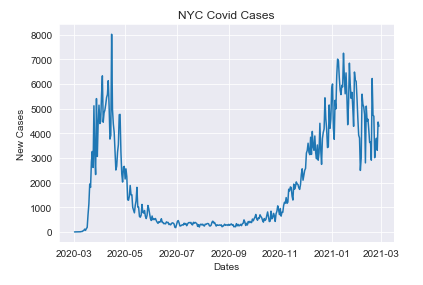
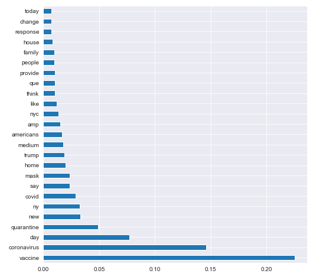
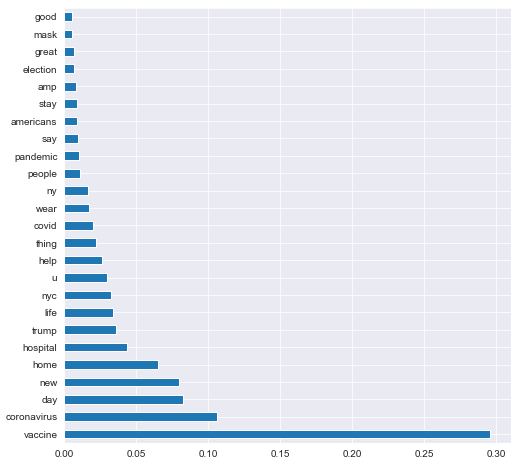
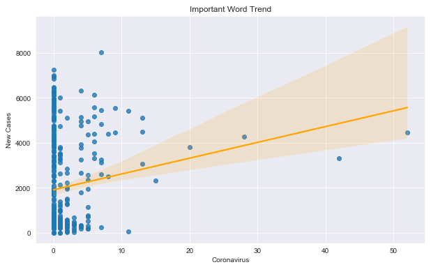
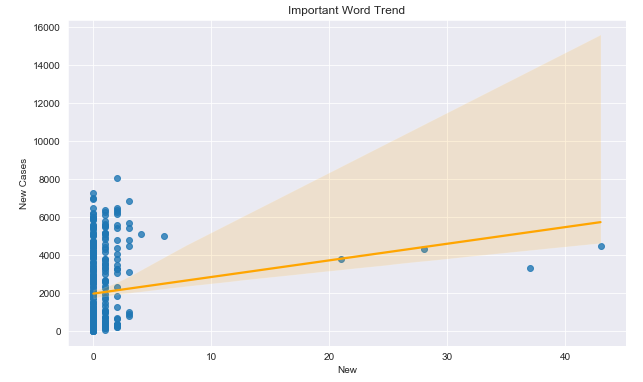
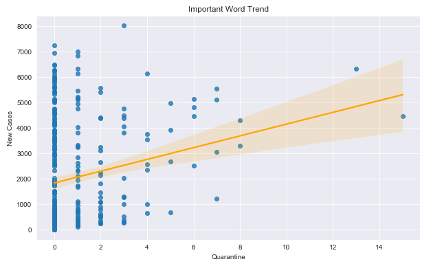
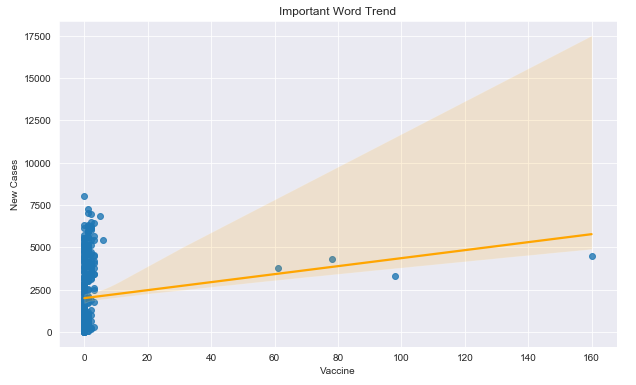

# NYC Covid-19 Cases and Twitter
Using Twint to filter through Covid related tweets from New York City to see if the message of a verified users affects the Covid infection/cases rate in NYC. In this project NLP and Random Forest Regressor will be utilize to see if there is any words that have a higher correlation with new Covid cases.

# Twint
[Twint API](https://github.com/twintproject/twint/wiki) is used to gather all of the tweets that is related to Covid found in New York City.
Some input parameters to obtain the desire tweets are:
- Location: New York City
- Date: 01/01/2020 - 02/14/2021
- Verified User
- Likes count greater than 50

The following words were used as search word to obtain the tweets:
- Covid
- Corona
- Coronavirus
- Mask
- Vaccine
- Quarantine

All desire tweets were compile into a csv file named 'covidtweets.csv' which contains approximately 3000 tweets

# NLP
NLP needed to be done to the tweets data before it can be used to model. Some of the cleaning that was done are:
- Removing hashtag symbol, url links, @username, punctuations, and digits 
- Tokenization was used to break up the tweets into a list
- Stopwords was used from the NLTK library to get rid of unnecessary or meaningless words
- Lemmatization was used to break down the words to it root form (for example: studying, studied, and studys were break down into study)
- Count Vectorize was use to count each individual words and compile all of the tweets from the same date into a single row.

# New York City Cases
After taking care of the text data, we will Covid cases data from NYC. Luckily The New York Times provide such dataset for anyone to use and is constantly update new reports nationwide. The dataset provide by [NYTimes](https://github.com/nytimes/covid-19-data) was modify to be new cases only found in New York City since that what we were most interested in. 

A graph of new Covid cases found in NYC:

# Modeling Process
Created two slightly different dataset for modeling, one that is the original data with count vectorizer. Another one where is the same as the original with one exception, it utilize the number of likes within a tweet to give more weight/value to the words. The idea is if there a tweet that someone liked, it shows that they are in agreement with the said tweet and are more likely to be influence by the tweet. 

Random Forest Regressor was used as the final model. GridSearchCV was used to find the best models within the given parameters, below are the feature importances graph of the original dataset and the likes count dataset.

Original:

Likes Count:

# Results
Here is the results as well for both models.

Original:
- Training R2: 0.61
- Test R2: 0.28
- Train RMSE: 1308.28
- Test RMSE: 1593.89

Likes:
- Training R2: 0.52
- Testing R2: 0.27
- Train RMSE:1437.65
- Test RMSE: 1606.66

Here we can see that the Original preform better than the Likes, the reason being why is there is a greater chance of outliers found within the Likes due to some 20,000 likes on a single tweets over many averaging 100 likes skewing the model. Ideally for both models the closer to 1.00 in the R2 the better and the smaller the number for RMSE the better the overall model preformance. 

# Post EDA
These are visuals of some of the higher ranking words found in the feature importances of both models to get a better idea of correlation and trends.

Coronavirus:

New:

Quarantine:

Vaccine:

# Conclusion
After a closer look at the feature importance graphs, there seems to be a decent amount of heatlh buzz words and some political words that correlate with new Covid cases within New York City. The verified user whenever they tweet on Twitter should be aware of what they are tweeting to their followers, as their message does have the potential to influence the behaviors of their readers. 

# Future Works
- Obtain more tweets to work with
- Further cleaning of NLP
  - Including more stopwords
  - Possible removing the keywords used for gathering tweets to get rid of potential bias
  - Placing language filter to keep it English only for modeling
- Create bi-gram or n-gram datasets
- Create smaller windows of time. For example looking at tweets and cases in a 3 month window, a snapshot.
- Create more paramters for GridSearchCV to go through to create better models
